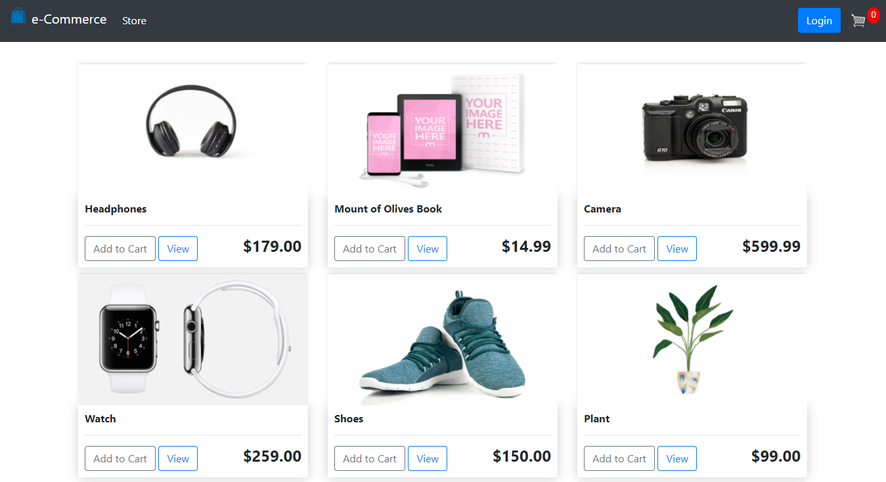
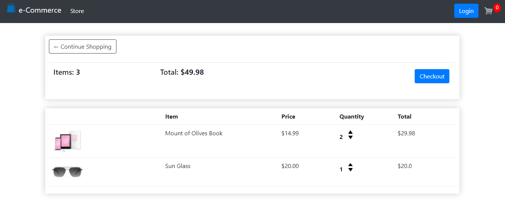
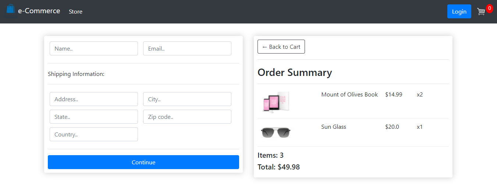

# eCommerce🛒
This is a fully functional eCommerce website with a beautiful user interface and backend functionalities.

## Technologies
1. Django (Backend)
2. Bootstrap (Frontend)
3. CSS (Frontend)
4. JavaScript (Client-Side)

## Preview
#### Store
<p align="left">
  
</p>

#### Cart
<p align="left">
  
</p>

#### Checkout
<p align="left">
  
</p>

## To Run This Project
1. clone this project on your local machine,
```
https://github.com/ThanhHuynh007/E-Commer-with-Django.git
```
2. create a virtual environment inside eCommerce folder,
```
virtualenv venv
```
3. activate virtual environment,(for windows)
```
.\venv\Scripts\activate 
```
4. install project dependencies from requirements.txt,
```
pip install -r requirements.txt
```
5. run project on your local machine,
```
python manage.py runserver
```
